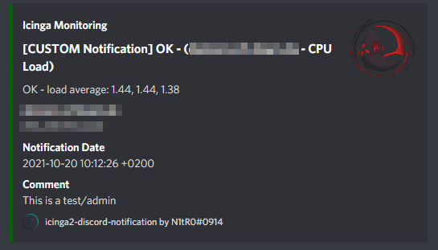
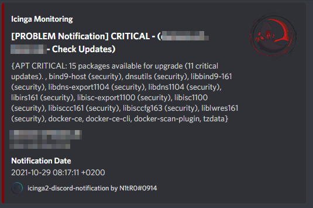

# Features
This plugin allows you to send your icinga2 notifications to your discord channel.
All the information shown in the email notification will be added to a discord embed.

# How to set up
You can find an example configuration for icinga2 in the `conf.d` folder. Simply append them to your configuration and make sure that you assign the correct host and contact groups. Fill in the webhook URL into the `users.conf` file. You can specify several webhooks via users and groups.

Additionally, copy the contents of the `scripts` folder to your icinga2 installation, e.g. `etc/icinga2/scripts` and make sure that they are executable. Fill out the missing value for `THUMBNAIL_URL`.
